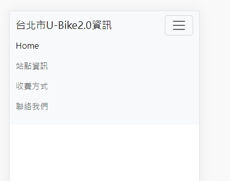

#網頁驗收
## 第一部分 github repo 的建立和成為web Server

1. ###使用gh指令建立github的repo
  -gh repo create my-project --public --clone

2. ###上傳網頁至github

3. ###將github設為page,首頁名稱使用index.html

## 第二部分 製作responsive Web Design (RWD)

1. ### 套用bootstrap的css和js檔
2. ### 建立導覽列
-手機直向和橫向才出現導覽列按鈕(把中斷點從lg改為md)

3. 

##驗收結果